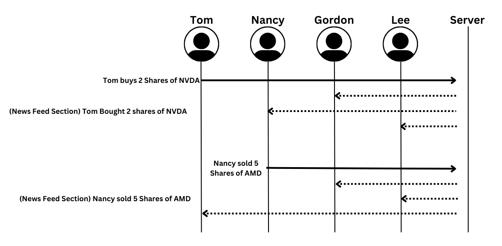

# EasyTrading App

[My Notes](notes.md)

look at me I made a change and I'm going to submit it into Github

That first edit was in VScode. This one is using the Github web app.

> [!NOTE]
> This is a template for your startup application. You must modify this `README.md` file for each phase of your development. You only need to fill in the section for each deliverable when that deliverable is submitted in Canvas. Without completing the section for a deliverable, the TA will not know what to look for when grading your submission. Feel free to add additional information to each deliverable description, but make sure you at least have the list of rubric items and a description of what you did for each item.

(I am not going to edit that paragraph above this because there are too many valuable reminders to lose, so here is proof that I read it!)

> [!NOTE]
> I reviewed the documentation about Markdown. Here is the link for future reference (https://docs.github.com/en/get-started/writing-on-github/getting-started-with-writing-and-formatting-on-github/basic-writing-and-formatting-syntax) before continuing.

## 🚀 Specification Deliverable

> [!NOTE]
>Fill in this sections as the submission artifact for this deliverable. You can refer to this [example](https://github.com/webprogramming260/startup-example/blob/main/README.md) for inspiration.

For this deliverable I did the following. I checked the box `[x]` and added a description for things I completed.

- [x] Proper use of Markdown
- [x] A concise and compelling elevator pitch
- [x] Description of key features
- [x] Description of how you will use each technology
- [x] One or more rough sketches of your application. Images must be embedded in this file using Markdown image references.

### Elevator pitch

Many people want to start trading in the stock market but face challenges that hold them back - whether it’s a lack of disposable income, fear of risk or volatility, or limited knowledge about trading. The EasyTrading App is a paper-trading platform designed to help users learn the fundamentals of stock market trading and analysis in a risk-free environment. Users can practice trades using real-time market data, collaborate, and compete to see who can grow their practice portfolio the most. The app is designed to be both educational and engaging, helping users gain confidence and skills before they start trading with real money.

### Design

This is an example of the EasyTrading UI homepage. It is designed to mimic other trading applications but keep it more simple. There will be a login page before the users can interact with their homepage, adn there will be four other options on the bottom of the screen they use. The diagram below shows how people would interact with the server, and how the server would save the data and communicate through the leaderboards/group tab.

### Key features

- News feed displaying the transations of each user in real time
- Leaderboard showing the users with the highest value portfolio
- Starting balance at $100,000 paper money
- Ability to exchange using current market prices
- Secure login through HTTPS
- Ability to view the portfolio of other users
- Page educating users on stock market and trading information
- Stock holdings persistently stored

### Technologies

I am going to use the required technologies in the following ways.

- **HTML** - Uses correct HTML structure for application. Five HTML pages. One for login, one for home page, one for leaderboard, one for education, and one for account information. Hyperlinks to choice artifact.
- **CSS** - Application styling that looks minimalistic and modern to make the application simple. Goal is to look good on multiple screen sizes with a standard color scheme of blue, black, and white (BYU colors!). Whitespace and contrast chosen with user experience considered.
- **React** - Provides login, search bar for finding stocks, stock list for all available stocks, portfolio section for tracking the users personal stocks and other portfolios, buy and sell interface to make transations, view the leaderboard, and display real-time news feeds. Login page, main trading UI, and the users holdings made through the react router.
- **Service** - Backend service with endpoints for user authentication, fetch available stocks, get the current and historical stock price, simulate buying and selling, update the leaderboard, and provide the users holdings and news feed.
- **DB/Login** - Store users accounts, stocks, trade history, and the leaderboard in the database. User credentials stored in database, and cannot login unless authenticated.
- **WebSocket** - Trades and leaderboard are broadcast to all other users on the platform.

## 🚀 AWS deliverable

For this deliverable I did the following. I checked the box `[x]` and added a description for things I completed.

- [x] **Server deployed and accessible with custom domain name** - [Connor's CS260 Startup Server](https://lolwinning.click).
- [x] **EC2, Route 53 were properly configured with the server**
- [x] **HTTPS and TLS enabled with Caddy**

## 🚀 HTML deliverable

For this deliverable I did all of the following. I checked the box `[x]` and added a description for things I completed.

- [x] **HTML pages** - All of the HTML pages that I need are made for each component of my application
- [x] **Proper HTML element usage** - I used proper HTML tags and formatted it correctly
- [x] **Links** - The pages are linked to eachother and I have a link to an external website in the "Learn" HTML section
- [x] **Text** - I have a ton of text all over every HTML document
- [x] **3rd party API placeholder** - I will need a 3rd party API to fetch live market data and stock information, so I put placeholders for these features.
- [x] **Images** - I included two different images within my project.
- [x] **Login placeholder** - The login page is included as a placeholder, and it is located in the index.html file so that it is the first page you encounter.
- [x] **DB data placeholder** - I will need to store data in a database for this project, with all the personal user data, the multi-user data, and the comments and purchase feed. I put placeholders here for the future.
- [x] **WebSocket placeholder** - I will need WebSocket for live market updates and the collaborative space as well, so there are placeholders for it in my documents.

## 🚀 CSS deliverable

For this deliverable I did the following. I checked the box `[x]` and added a description for things I completed.

- [ ] **Header, footer, and main content body** - I did not complete this part of the deliverable.
- [ ] **Navigation elements** - I did not complete this part of the deliverable.
- [ ] **Responsive to window resizing** - I did not complete this part of the deliverable.
- [ ] **Application elements** - I did not complete this part of the deliverable.
- [ ] **Application text content** - I did not complete this part of the deliverable.
- [ ] **Application images** - I did not complete this part of the deliverable.

## 🚀 React part 1: Routing deliverable

For this deliverable I did the following. I checked the box `[x]` and added a description for things I completed.

- [ ] **Bundled using Vite** - I did not complete this part of the deliverable.
- [ ] **Components** - I did not complete this part of the deliverable.
- [ ] **Router** - Routing between login and voting components.

## 🚀 React part 2: Reactivity

For this deliverable I did the following. I checked the box `[x]` and added a description for things I completed.

- [ ] **All functionality implemented or mocked out** - I did not complete this part of the deliverable.
- [ ] **Hooks** - I did not complete this part of the deliverable.

## 🚀 Service deliverable

For this deliverable I did the following. I checked the box `[x]` and added a description for things I completed.

- [ ] **Node.js/Express HTTP service** - I did not complete this part of the deliverable.
- [ ] **Static middleware for frontend** - I did not complete this part of the deliverable.
- [ ] **Calls to third party endpoints** - I did not complete this part of the deliverable.
- [ ] **Backend service endpoints** - I did not complete this part of the deliverable.
- [ ] **Frontend calls service endpoints** - I did not complete this part of the deliverable.

## 🚀 DB/Login deliverable

For this deliverable I did the following. I checked the box `[x]` and added a description for things I completed.

- [ ] **User registration** - I did not complete this part of the deliverable.
- [ ] **User login and logout** - I did not complete this part of the deliverable.
- [ ] **Stores data in MongoDB** - I did not complete this part of the deliverable.
- [ ] **Stores credentials in MongoDB** - I did not complete this part of the deliverable.
- [ ] **Restricts functionality based on authentication** - I did not complete this part of the deliverable.

## 🚀 WebSocket deliverable

For this deliverable I did the following. I checked the box `[x]` and added a description for things I completed.

- [ ] **Backend listens for WebSocket connection** - I did not complete this part of the deliverable.
- [ ] **Frontend makes WebSocket connection** - I did not complete this part of the deliverable.
- [ ] **Data sent over WebSocket connection** - I did not complete this part of the deliverable.
- [ ] **WebSocket data displayed** - I did not complete this part of the deliverable.
- [ ] **Application is fully functional** - I did not complete this part of the deliverable.
